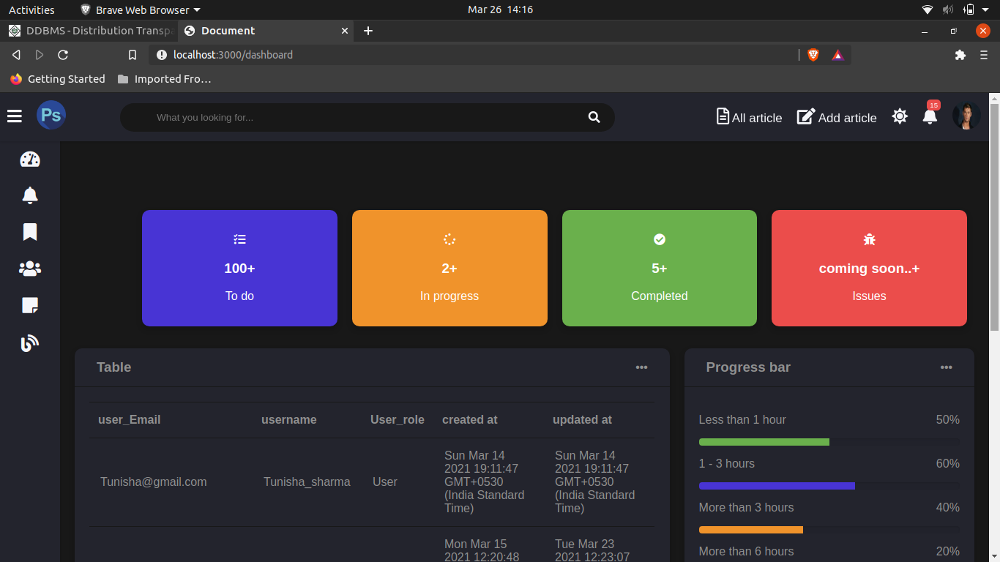
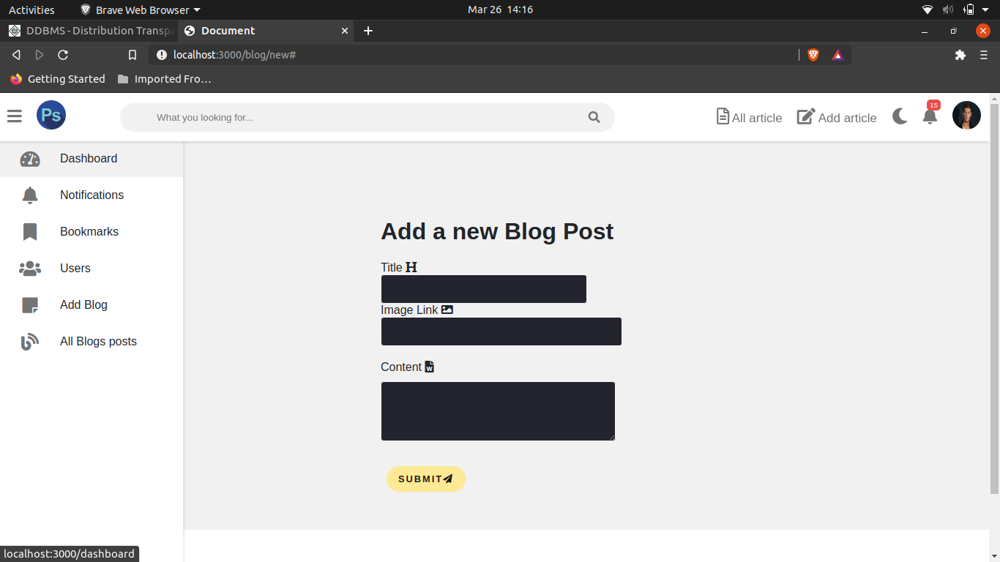
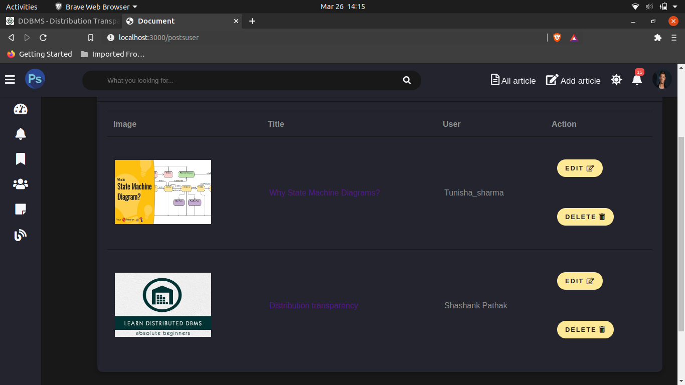
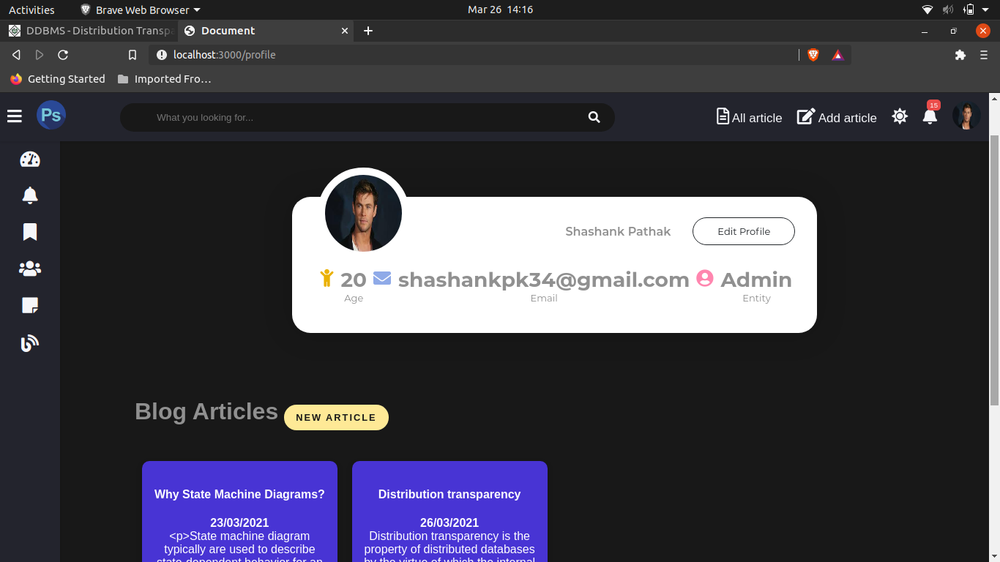
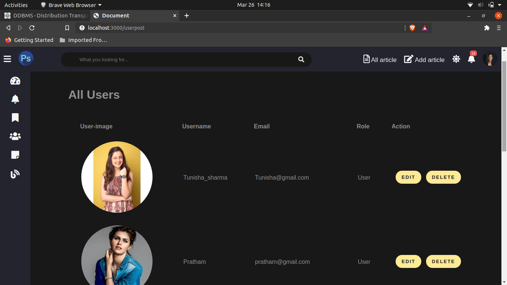
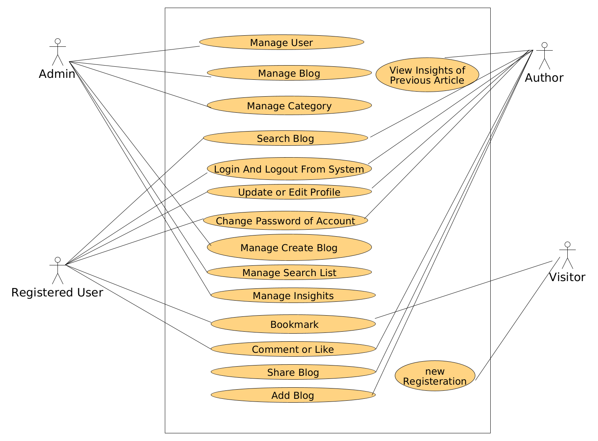
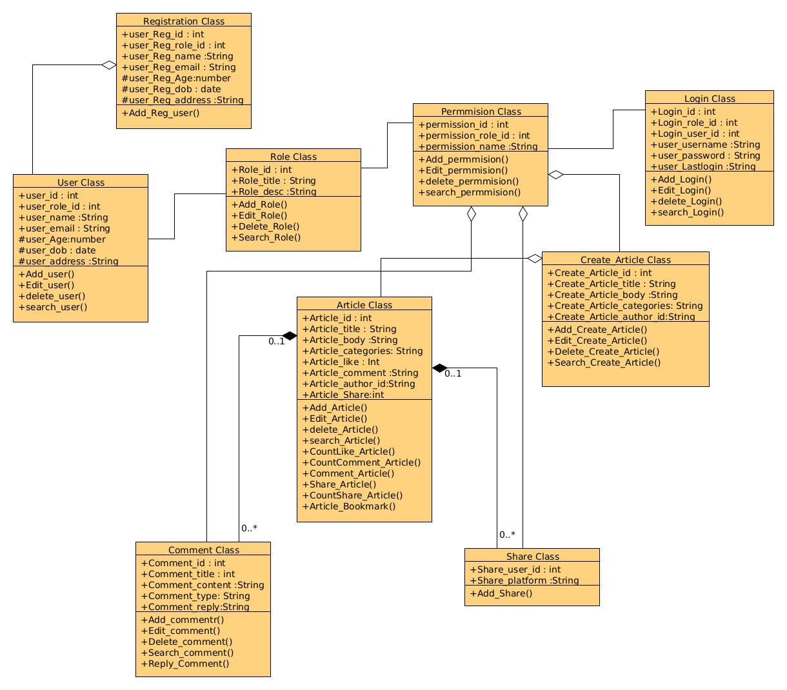
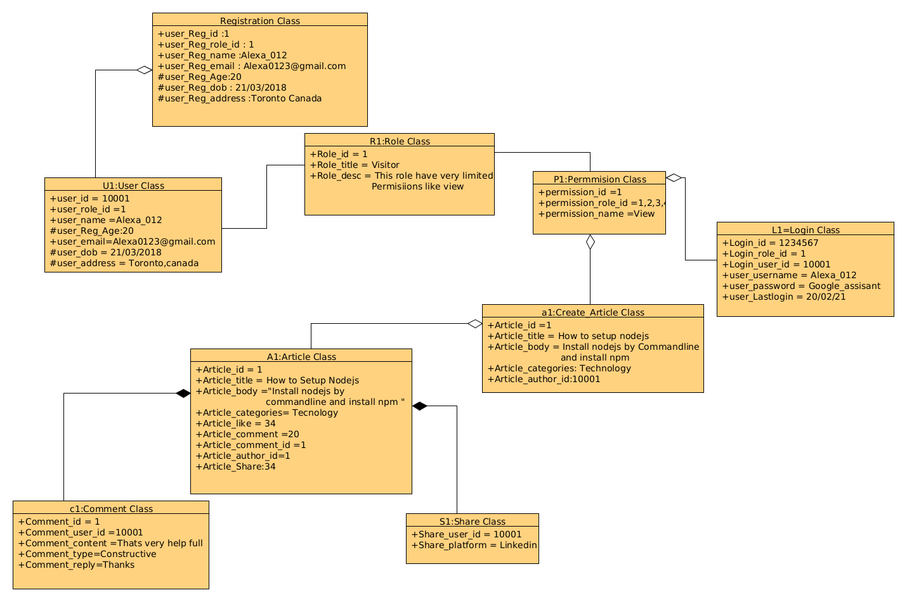
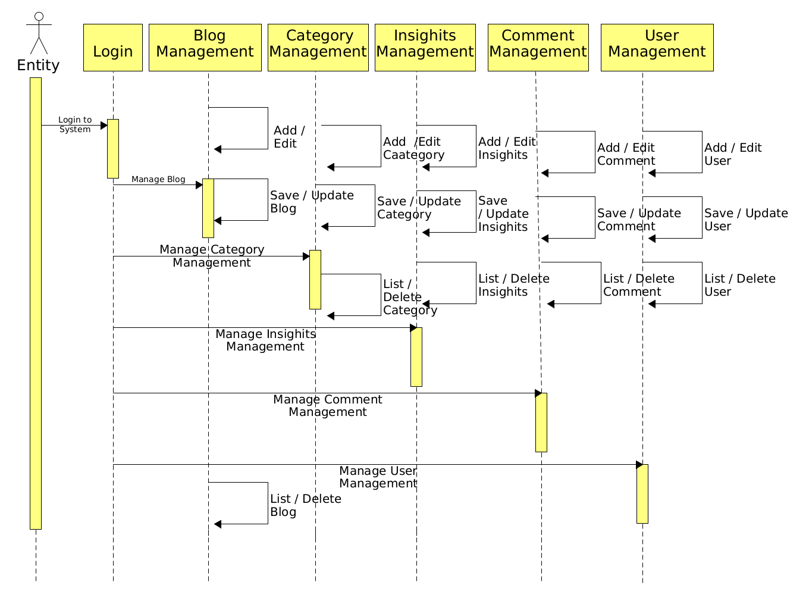
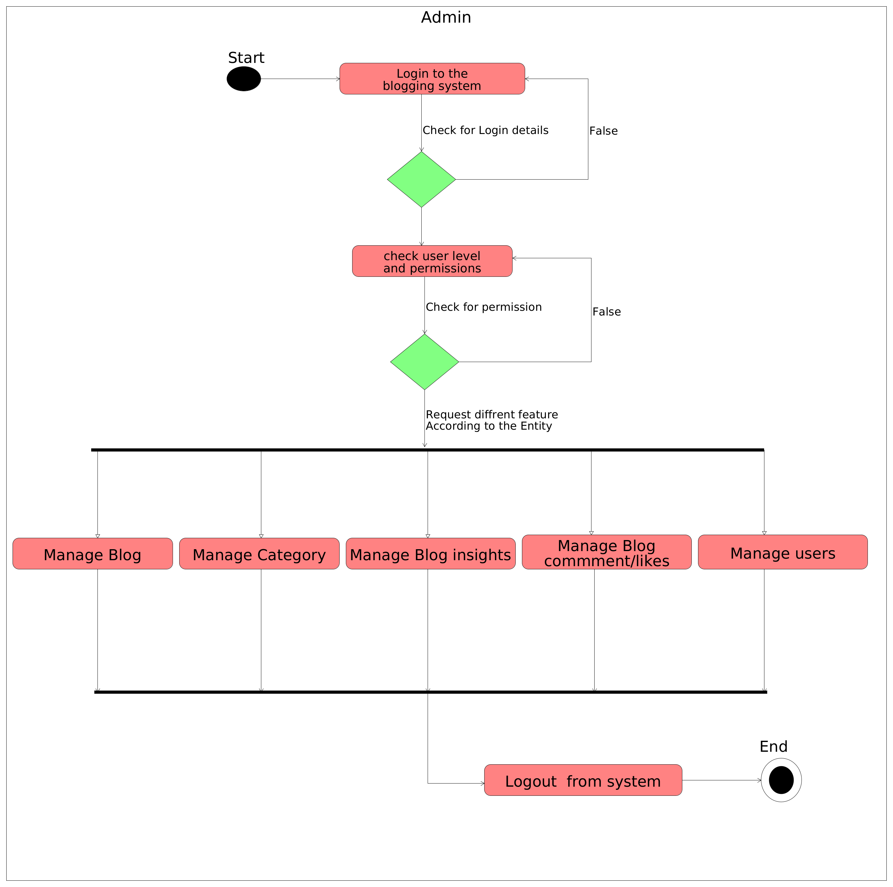

# This is My Blog Cms Website.

## Features
 - Add Blog 
 - Edit Blog According to the Authorisation and ownership. 
 - View Random Blogs.
 - Comment on Blogs 
 - Dashboard for Admin Where he/she can view the Important Info in the Website.
 - Admin can manage Blogs and Users.
 - Admin have all permission like Edit Users Details and Delete A user .
 - User have there Profile pages.

## Skills i learned Through this project.
-Mongodb (data manipulation , Mongodb Atlas, Mongodb Population ,referencing collection etc;).
-Basic Nodejs How to use nodejs and npm.
-Learnt ajax requests by using Express.
-Basic Authentication system by Passportjs.
-Basic Express Model-view-Controller(mvc) Model.
-Basic Commenting system on an application.
-Using Static files by public and template engine.

## Important Images With Title Here 

### AddBlog Form

### All Blogs Seen By Admin
: As a Table form  have links to go view Blog and Buttons to edit and Delete Blogs.

### User's Profile view

### All Users Seen By Admin
As a Table form  have links to go view Users and Buttons to edit and Delete Blogs.

## Now To run this Project on your Machine
- ### clone this Project 
- ### > npm install
- ### Do First:
  Before running any command go to app.js file and Change the Database.
- ### > npm start
  
## This is the uml Diagram for my Project.

  - ### Usecase Diagram 
      
  - ### Class Diagram   
    
  - ### Object Diagram   
    
  - ### Sequence Diagram 
    
    

  - ### Activity Diagram 
     
  - ### State Machine Diagram
       

## Thanks thats all by my side.  
  
